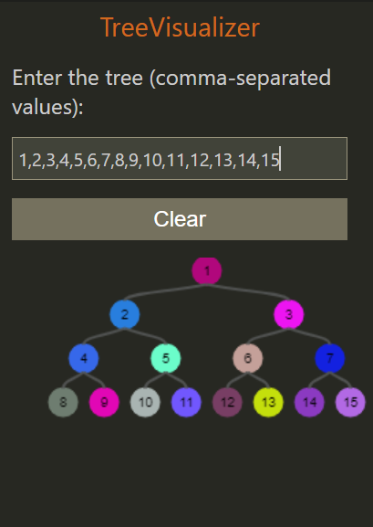
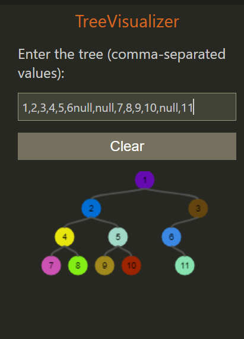

## An Array to Binary Tree Visualizer

## Features

This extension offers an interactive interface where users can input a comma-separated array of integer values or null values. It dynamically generates a real-time visualization of a binary tree based on the input. This feature enables users to visualize and interact with binary tree structures seamlessly.

## VS Code API

### `vscode` module

- [`vscode.api`](https://code.visualstudio.com/api)
- [`vscode.publish`](https://code.visualstudio.com/api/working-with-extensions/publishing-extension)

## Running the example

- Open this example in VS Code 1.46+
- `npm install`
- `npm run watch`
- `F5` to start debugging

